# EvolutionSaver

### Refactor your web applications based on schema change
  - Table, column, association rename
  - Table, column, association, index delete
  - Column, association type change
 
### Publication

- Automated Code Refactoring upon Database-Schema Changes in Web Applications

### Supported language
  - Django
  - Rails

# Tutorial includes

  - how to install
  - how to use

# Installation
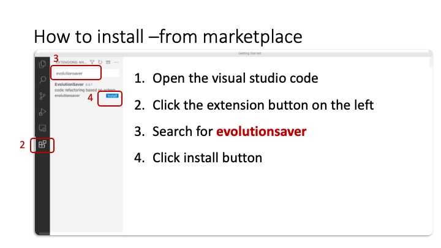

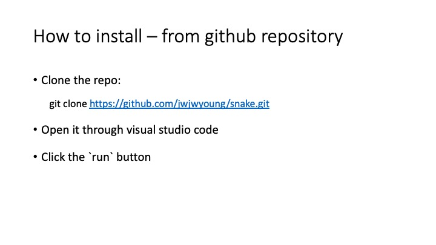

# Usage

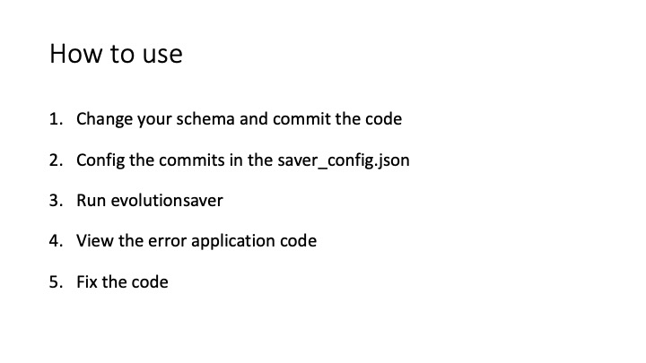

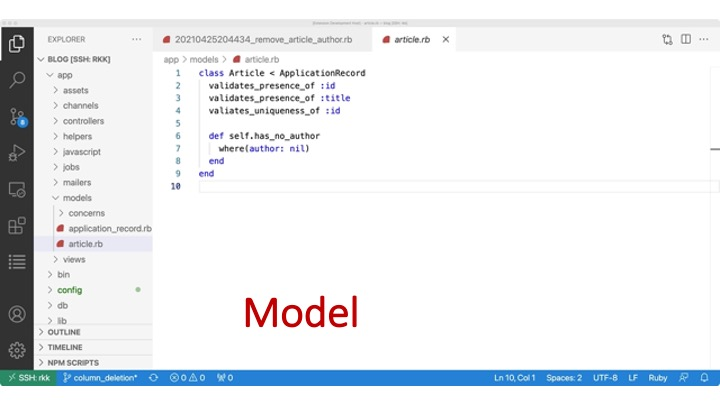

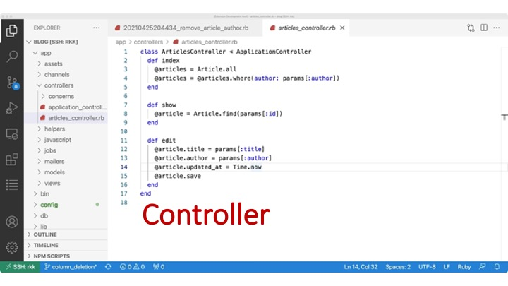

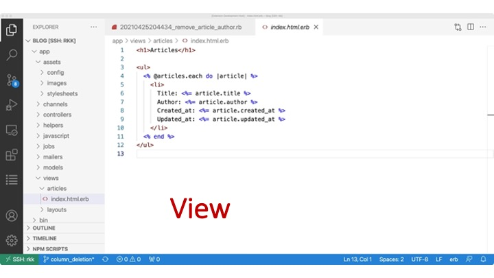

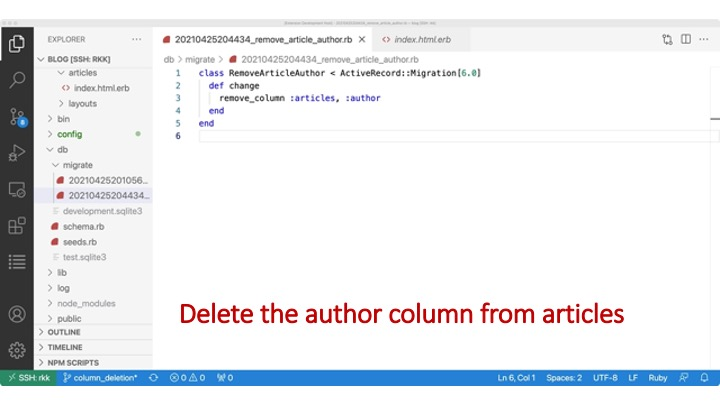

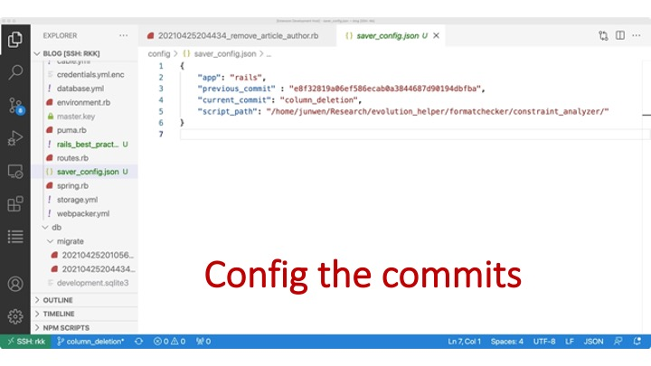

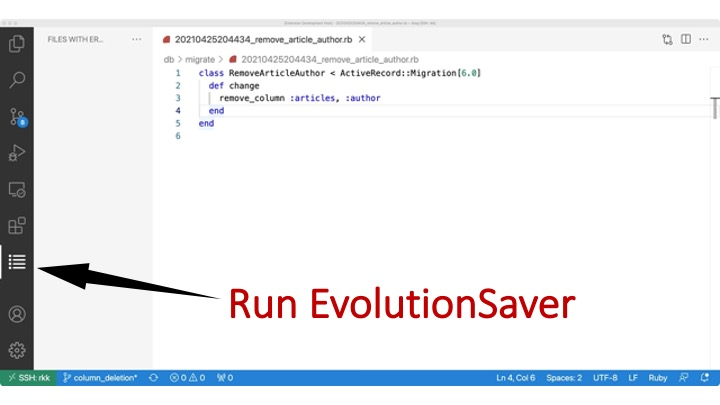

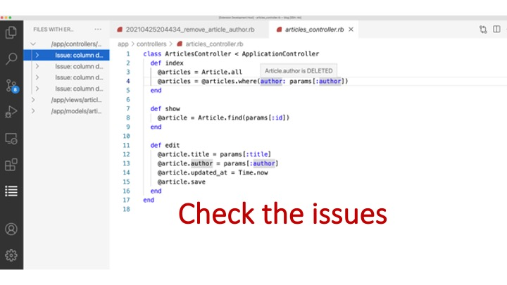

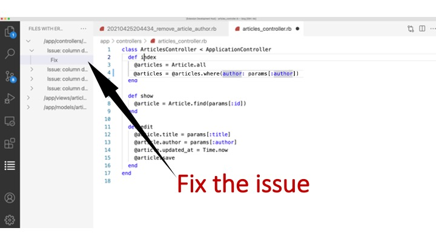
